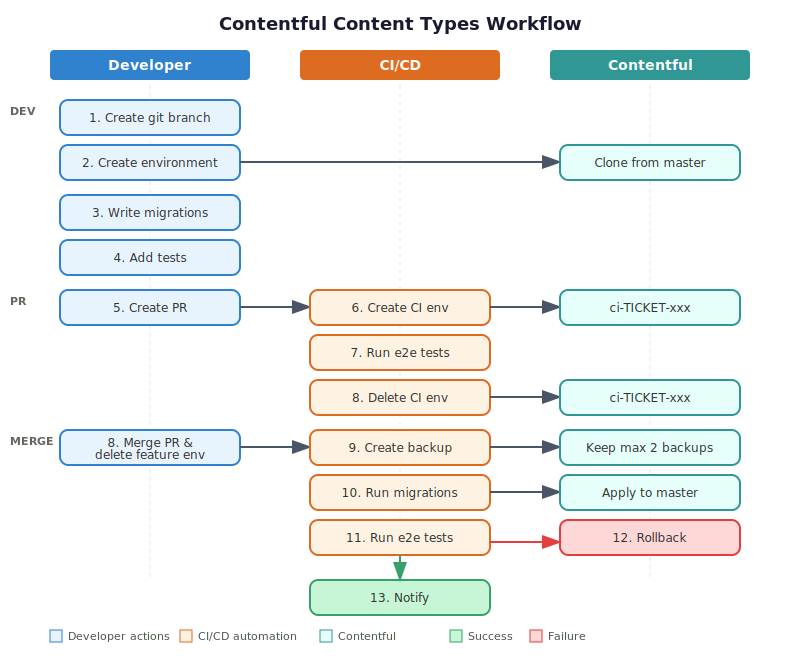

# Contentful Configuration

This documentation describes the Contentful environment setup, content types workflow, and CI/CD integration for managing content model changes.

## Environment Overview

| Concept | Value | Description |
|---------|-------|-------------|
| Environment Alias | `master` | Points to the active production environment |
| Environment | `production` | The production environment |
| Environment | `feature-TICKET-{number}-{description}` | Developer-created environment for testing content type changes |
| Environment | `ci-TICKET-{number}-{description}` | CI-created temporary environment for automated testing |
| Content Workflow | Direct editing | Editors work directly in `master` |

**Note**: No content migration flow is needed. Editors always work in the `master` environment.

## Content Types Workflow



Follow these steps when making content type changes:

### Step 1: Create Git Branch

Create a branch following the naming convention:

```bash
git checkout -b feature/TICKET-123-add-hero-section
# or
git checkout -b fix/TICKET-456-update-article-fields
```

**Format**: `{feature|fix}/TICKET-{number}-{description}`

### Step 2: Create Contentful Environment

Create a matching environment in Contentful:

1. Go to **Settings → Environments** in Contentful
2. Click **Add environment**
3. Clone from: `master`
4. Name: `feature-TICKET-123-add-hero-section` (match your branch name)

**Tip**: Keep branch and environment names in sync for traceability.

### Step 3: Write Migration Scripts

Create migration scripts in `infra/contentful/migrations/`:

```bash
infra/contentful/migrations/
├── 001-add-hero-section.ts
└── 002-update-article-fields.ts
```

Use AI assistance when writing migration scripts.

### Step 4: Add Tests

Create tests to verify migrations work as expected:

```bash
infra/contentful/migrations/__tests__/
└── 001-TICKET-123-add-hero-section.test.js
```

### Step 5: Create Pull Request

Push your branch and create a PR. Include:

- Description of content type changes
- Link to the Contentful environment
- Screenshots if applicable

## CI Pipeline

### On Pull Request

When a PR is created:

1. CI creates a temporary Contentful environment from master: `ci-TICKET-123-add-hero-section`
2. CI runs migrations against the temporary environment
3. CI runs e2e tests with the new Contentful environment
4. Once the pipeline completes, CI deletes the temporary environment

### On Merge to Main

When the PR is merged:

1. CI creates a backup from `master` (keeps maximum of 2 backups)
2. CI runs migrations against `master`
3. CI runs e2e tests
4. **If pipeline fails**: CI points `master` alias to the backup
5. **If pipeline succeeds**: CI sends release notifications

### Post-Merge Cleanup

After merging:

- Delete your feature branch
- Delete the Contentful environment you created in Step 2

## Environment Variables

Configure these environment variables for CI:

| Variable | Description |
|----------|-------------|
| `CONTENTFUL_MANAGEMENT_TOKEN` | Management API token for running migrations |
| `CONTENTFUL_SPACE_ID` | Your Contentful space ID |
| `CONTENTFUL_ENVIRONMENT` | Target environment (usually `master`) |

